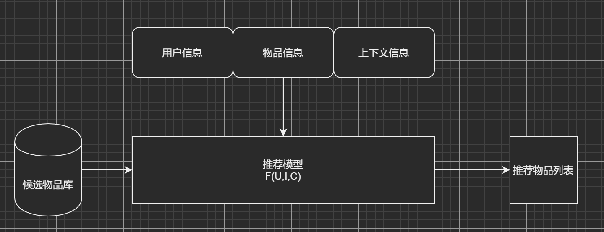
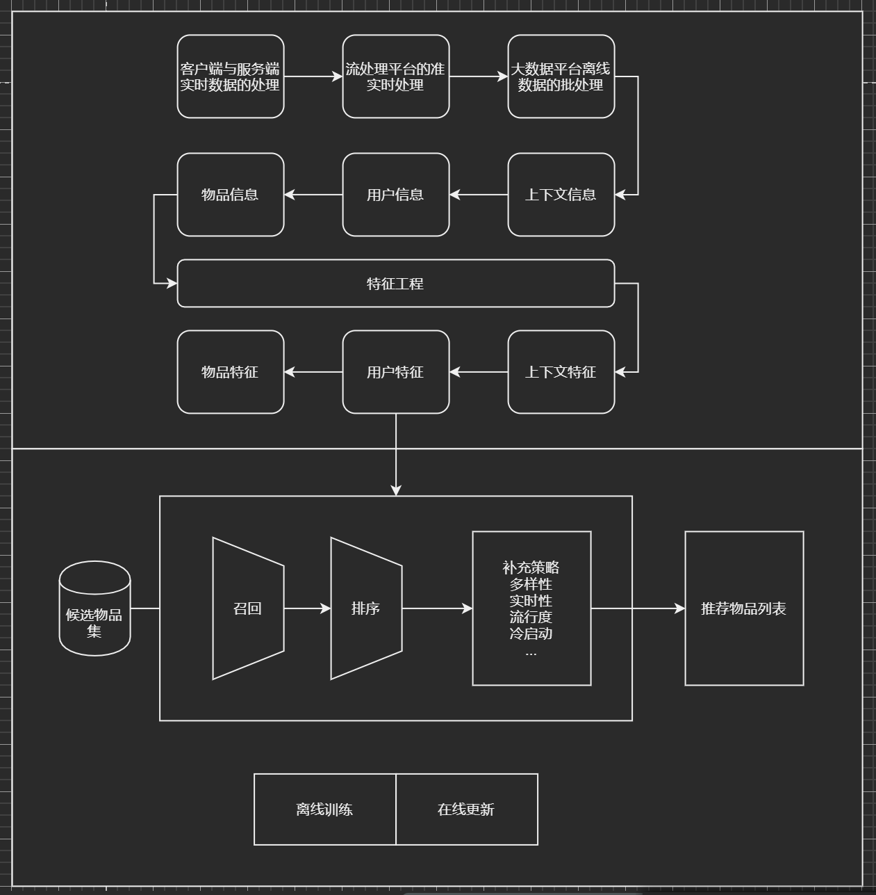

## 序
#### 深度学习对推荐系统的影响

1. 机器学习在推荐系统工业应用的瓶颈
    * 传统机器学习模型的假设条件太苛刻，无法适应复杂的业务场景。
    * 工业场景计算规模大，需要大量工程实现并行计算。
2. 深度学习的突破，打破了算法在推荐系统应用的限制
    * 模型设计由复杂函数的设计优化转为简单网络结构的组合设计优化。
    * 优化方法的统一和简化
    * 模型设计和实现的解耦
3. 深度学习在推荐系统工业应用
    * 拿锤子找钉子，把最新的技术应用在自己的场景上。
    * 问题驱动，定义问题，明确技术需求，调研相关技术工具。
4. 深度学习应用在推荐系统中的瓶颈
    * 搭积木式的模型演进的边际收益越来越低
    * 模型复杂度越来越高对数据的需求也越来越高
    * 模型的发展需要工程系统架构的升级改造
5. 发展方向
    * 深度学习成为基础设施
    * 单点突破转变为技术体系的优化，主要是算法和系统架构的协同设计

## 第一章
#### 推荐系统需要解决的问题

* 互联网为公司和用户提供了交互场景，公司提供商品，用户消费商品，公司为商品找到合适的消费人群提高收益和用户找到符合需求的商品是一致的，都是为了促成有效消费的产生。但海量商品和消费需求的多样性使得消费过程变得缓慢。

* 从用户的角度来看，推荐系统解决的是用户如何在信息过载的情况下高效获取感兴趣的信息的问题。

* 从公司的角度来看，推荐系统解决的是使产品吸引用户、留存用户、提高用户粘性、提高用户转换率的问题，从而达到商业目标。

* 推荐系统所解决的问题就是促成消费的产生，具体来说就是将承载着公司利益的“信息”提供给对它感兴趣的用户，提高“消费”效率。关键在于如何找到“公司”和“用户”这两个维度的共同点。

* 实例 \
YouTube是一家以广告位主要收入来源的公司，其商业利益建立在用户观看时长的增长上，因为观看总时长广告曝光量成正比，因此公司利益和用户体验在“观看时长”这一点上达成一致。

#### 推荐系统的架构
* 逻辑框架 \
    推荐系统的具体任务就是从商品池中选择出特定用户感兴趣的商品，实现公司利益最大化，满足用户需求。因为推荐过程发生在具体的现实场景下，所以形式化的定义推荐就是给定商品信息、用户信息、场景信息构建一个函数输出用户感兴趣的商品列表。
    

* 技术框架
    1. 数据和信息相关的问题，即用户信息、物品信息、上下文信息分别指的是什么，如何获取，如何保存的问题。
    2. 推荐系统算法和模型相关的问题，即模型如何训练、预测、部署的问题。
  

