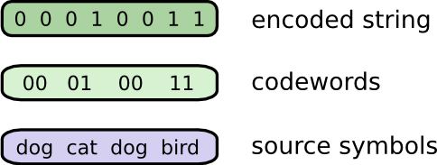
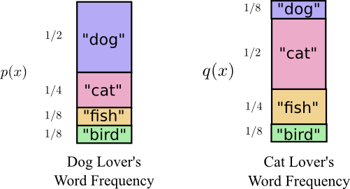

## 信息论
信息论将信息的传递和度量作为一种统计现象来考虑。以某一概率分布$P(X)$来表示信息中随机事件$X=x_i$和对应的可能性$P(X=x_i)$，概率分布中的各种取值和可能性反映了系统整体的不确定性。信息表示的是该概率分布$P(X)$中的某一随机事件$X=x_i$是否发生，信息量的大小取决于该随机事件发生的可能性P(X=x_i)。

#### 如何量化信息

* 凡是可以减少不确定性的都可称之为信息。

* 信息量是一个相对值，描述的是某个随机事件发生后所带来的信息大小。

* 在概率论的框架下信息量的定义为：如果对一个已知的概率分布$P(X)$,事件$x_i$发生概率为$p(X=x_i)$，那么当观察到该事件发生时所获取的信息量定为$I(p(X=x_i) = -\log_b(p(X=x_i))$。

* 例如某男星A之前被认为是国民老公，大家普遍认为他大概率不会出轨，那么用一个随机变量$X$表示事件：A是否出轨，那么$X$在当下服从一个概率分布如下，当此时如果爆出新闻：A被抓拍到和某女星开房，最后石锤A已出轨。那么这条新闻的信息量是$-\log_b(0.1)$
    $$ P(X) = \begin{cases} 0.1, & \text{X=1,A出轨} \\ 0.9 &  \text{X=0,A不出轨} \end{cases} $$
  如果该男星A之前被多次爆出出轨，那么事件$X$服从的概率分布就不同了，如果此时再爆出新闻:A被抓拍到和某女星开房，最后石锤A出轨。那么这条新闻的信息量是$-\log_b(0.9)$
    $$ P(X) = \begin{cases} 0.9, & \text{X=1,A出轨} \\ 0.1 &  \text{X=0,A不出轨} \end{cases} $$
  对比这两种情况，可以看出如果被观测到的事件发生的概率越低则表示的信息量越大。

* 我们已经知道了当概率分布$P(X)$中的某一随机事件$X=x_i$发生时可以获取的信息量，那么观测到任意一个随机事件时平均获得的信息量就表示为$-\sum_{i=0}^n p(x=i)\log_b(p(x=i)) $, 因为不确定性越大可以获得的平均信息量也就越大，即不确定性和平均获得信息量成正比，由此我们可以使用能够获得的平均信息量来衡量随机变量$X$的不确定性即熵的定义。

* 概括来说，信息论中信息的传递、信息量的大小都作用于概率分布$P(X)$。在获取某特定信息前，概率分布为$P_{pre}$,当获取到某一信息即观测到某一随机事件发生时，在获得对应的信息量的同时也改变了概率的分布，从而影响了整体的不确定性。

#### 信息如何编码

* 信息论中认为信息是经过编码器编码后通过一定的通道传输然后被解码器解码，最后传递给目标。既然信息表示的是在概率分布$P(X)$下某一事件$X=x_i$发生与否,那么信息的编码即是在概率分布$P(X=x_i)$下对不同事件$X=x_i$的编码。

* 以我们的语言为例，我们说话时某一单词出现的概率为$P(X=x_i)$,那么单词集合即是总体，这里信息的编码就成了对单词的编码，为了能在计算机中处理信息我们使用二进制进行编码。

  * 等长编码：假如有一个朋友他非常喜欢谈论动物而且它只会说5个动物的名称“dog”, “cat”, “fish” and “bird”.并且他只通过二进制与别人交流。为了能够与别人交流，他需要一个单词到二进制位的映射关系即对单词进行编码，每次交流前，他会首先将单词转换为二进制码发送给对方。这时编码是等长的，如果编码长度为n那么他能够表达的单词为2的n次方个。
  
  
  
  * 变长编码：由于每次通信会有相应的开销，如果每个词的二进制位都是等长的那么每个词的开销也是相等的，频率和单词对应的分布如图所示，由此可以得到平均编码长度为这个区域的面积=2。为了减小通信的开销，Bob决定根据交流时单词的频率修改单词对应的二进位。
  
  
  可以根据单词的使用频率改变对应的编码长度，经常使用的词使用更短的编码，不经常使用的使用较长的编码，但是短编码不能作为长编码的前缀，否则接受端就无法区分这两个编码。所以使用短编码表示频率较高的词会导致其它词的编码较长。而我们需要关注的是发送信息的编码越短越好，即平均编码长度越短越好。由单词和编码长度的分布图可知其平均编码长度为1.75bits.对于任何分布，总会存在一个编码方案使得其它编码方案的平均编码长度都比它长，该编码方案的平均最短编码长度或者说平均可获得信息量称为该分布的熵。
  
  
  
  * 最优的变长编码：编码长度不同对应的可编码数也不同，在上面的三位变长编码中存在多种不同的变长编码方案，如何划分编码使得平均编码长度最短，而且满足不存在前缀编码的条件即可以解码。考虑到如果出现前缀编码则接受端无法解码，所以当使用某个短编码表示频率高的词时，那么以该编码为前缀的任何编码都无法再使用。这样对于频率高的词给与了较短的编码的同时我们损失了剩余位的编码。也就是说我们牺牲了部分编码来获取一个短编码。为了获得平均最短编码方案，需要平衡短编码和损失掉的编码
  
  
  由于变长编码的稀疏性可知，短编码的选择是通过损失掉部分编码获取的，即需要为短编码支付代价。如果想获取一个长度为1的编码如0，则成本为1/2，因为这会损失掉一半的编码。如果想要获取长度为2的编码如01，则成本为1/4，因为所有可能的编码中有1/4是以01开头的。短编码的成本会随着段编码的长度呈指数下降。如果损失呈指数下降，那么对应的高度和面积也是呈指数下降。每个编码对平均编码长度的贡献是该编码的长度乘以对应的概率。
  
  
  对于平均编码长度的贡献度和损失都和该编码的长度有关。编码长度决定了成本，编码越短成本越高但可以减小平均编码长度。编码越长成本越低，但会增加平均编码长度。
  
  
  对于最优变长编码的选择在于如何平衡编码长度与成本。最自然的想法就是根据该编码的使用频率来决定为其支付的成本，如果一个编码使用频率为1/2，那么久使用1/2的成本获取这个短编码。例如事件a发生的概率为p(a)事件b发生的概率p(b)。我们可以使用p(a)的成本获取a的短编码，使用p(b)的成本获取b的短编码。
  

#### 熵

* 前面已经提到，平均最短编码长度被称为熵，那么如何计算呢？平均编码长度等于编码使用概率乘以长度，而长度又和损失成反比即$cos⁡t=\frac{1}{2^L}$所以可以得到编码长度为$\log_{2}(\frac{1}{cost})$，而损失就是$p(x)$，由此可得熵的计算公式$H(X)=\sum_{i=0}^n p(x_i)\log_2(\frac{1}{p(x_i)})=\sum_{i=0}^n p(x_i)I(x_i)$，其中$I(x)$表示编码长度。
  
* 总结来说熵描述的是一个变量的不确定性程度，或者说该变量的平均最短编码长度。

* 分布为均匀分布时熵最大，证：
  随机变量$X$的概率分布为
  $$ P(X)= \begin{cases} p_1,   X=x_1 \\  p_2,  X=x2 \\ ... \\  p_n,    X=xn  \end{cases} $$
  熵为
  $$ H(X) = -\sum_{i=1...n} p(x_i) \log_{2}p(x_i) $$
  并且
  $$ \sum_{i=1...n}p(x_i) = 1 $$
  由拉格朗日乘子法可得
  $$ G(p_1,p_2,,,p_n,\lambda) = -\sum_{i=1...n}p(x_i)\log_{2}p(x_i) + \lambda(\sum_{i=1...n}p(x_i)-1) $$
  分别对$\lambda$和$p_i$求导，并令其等于零，最后可得
  $$\begin{cases} \frac{\partial G}{\partial p_i} = -\log_2{p_i} - \frac{1}{\ln{2}} + \lambda = 0 \\ \sum_{i=1...n}p_i - 1= 0 \end{cases} $$
  $$\sum_{i=1...n}p(x_i)-1 = 0 $$
  最后可得
  $$p_1=p_2=...=p_i = 2^{(\lambda - \ln{2})} = frac{1}{n}$$
  此时对应的熵为$\ln{n}$

#### 交叉熵与KL散度

* 由上述可知每一个分布，都有一个使得平均编码最短的编码方案，如Bob和Alice都使用相同的词，但使用的频率不同，也就是分布不同。根据Bob的词频分布会有他自己的最短编码方案，同样Alice根据她的词频分布也会有自己家的最短编码方案。每个人使用自己的编码方案交流时平均编码长度最短，如果Bob使用Alice的编码方案会得到平均编码长度不是最短的。

* 当一个分布使用另一个分布的最优编码方案时的平均编码长度称为交叉熵：
$$Hq(p) = -\sum_{i=1...n} p_i \log_2 q_i$$

* 交叉熵描述了两个分布的差异性，如果两个分布相同那么他们最优编码方案也想同，所以交叉熵最低，如果两个分布相差很大那么平均编码长度会远大于熵。所以可以使用交叉熵和熵的差值来描述当一个分布使用了另一个分布的最优编码后的平均编码长度的变化，以此来衡量两个分布的差异，这个差值称为KL散度。在机器学习中经常使用交叉熵来衡量预测分布和真实分布的差别。

#### 联合概率分布的熵
* 联合概率分布的熵为：
  $$ H(x) = \sum_{x,y} p(x,y) \log_2 (\frac{1}{p(x,y)}) $$
  
  

#### 条件熵

* 对于多元变量联合概率分布进行编码可以使用上述所示的联合概率分布的熵，如果某个变量已知的情况下，对未知的变量进行编码显然原有的联合概率分布的最优编码已不再是最优的，因为某些信息是已知的不需要编码。例如，天气和穿衣两个变量的联合概率分布，当天气已知的情况下对穿衣这个变量进行编码：

此时计算最优编码长度称为条件熵
$$p(X|Y) = \sum_{y} p(y) \sum_{x} p(x|y) \log_2 \frac{1}{p(x|y)} = \sum_{x,y} p(x|y) \log_2 \frac{1}{p(x|y)}$$

#### 互信息（信息增益）
* 当两个变量是相关的时候，说明两个变量的所包含的信息是有重复的，条件熵所计算的就是已知某个变量的情况下对另一个变量编码的平均最短编码长度，而两个变量重叠部分的信息的编码可以通过熵与条件熵的差值表示。如果两个变量相互独立则熵和条件熵是相同的。
$$ I(Y|X) = H(Y) - H(Y|X) \\
          = H(Y) + H(X) - H(X,Y) \\
          = \sum_y p(y) \log_2 \frac{1}{p(y)} + \sum_x p(x) \log_2 \frac{1}{p(x)} - \sum_{x,y} p(x,y) \log_2 \frac{1}{p(x,y)} \\
          =\sum_{x,y} p(x,y) \log_2 \frac{x,y}{p(x)p(y)} \\
   \text{注：} \\
   \sum_y p(y) \log_2 \frac{1}{p(y)} = \sum_y (\sum_x p(x,y)) \log_2 \frac{1}{p(y)} \\
                                     = \sum_{x,y} p(x,y) \log_2 \frac{1}{p(y)}
$$

* https://colah.github.io/posts/2015-09-Visual-Information/