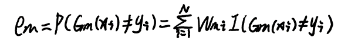
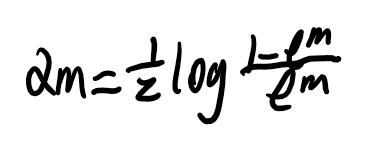
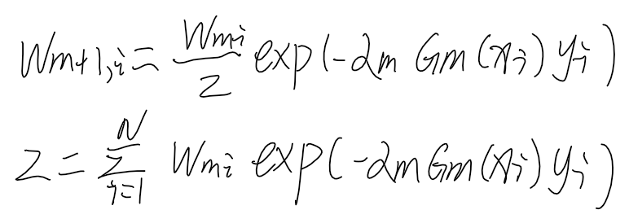
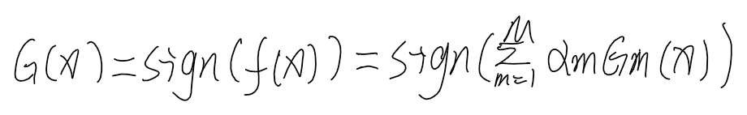
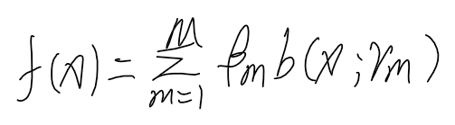
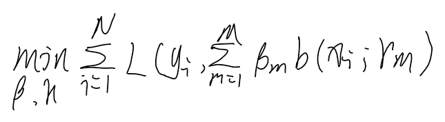
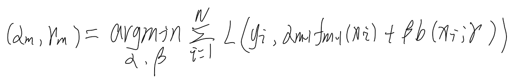
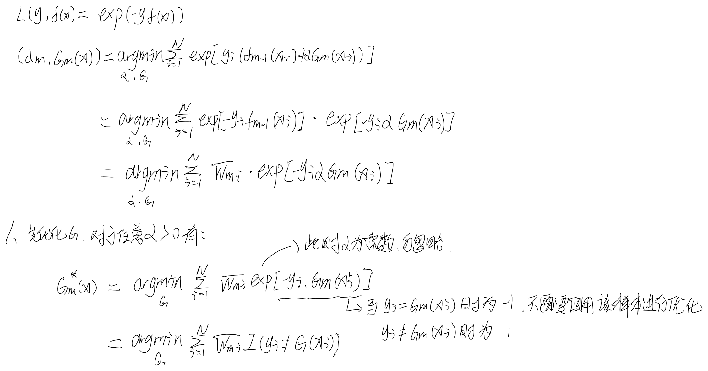

## Boosting

#### 什么是Boosting
* Kearns和Valiant提出了PAC（probably approximately correct）学习框架，该框架规定通过一个多项式学习一个概念，如果可以获得的正确率很高，则称这个概念是强可学习的，若正确率略微高于随机，则这个概念是弱可学习的。在该框架下一个概念是强可学习的充分必要条件时这个概念是弱可学习的。也就是说可以通过某些方法将弱可学习算法提升（Boost）为强可学习。

* 对于大多数问题而言容易获取弱学习器，那提升方法就是从弱学习器出发，反复学习，获得一系列若学习器，然后组合这些弱学习器构成一个强学习器，大部分提升算法是通过改变训练样本的概率分布（训练数据的权值分布）来学习一系列若学习器的。

* 这样在将弱学习器提升为强学习器时需要解决两个问题，一个是如何改变每轮训练时的样本权重，二是如何将弱学习器组合起来。

## AdaBoost算法（Adaptive）
#### 基本思想
* 通过多轮训练获得多个若学习器，最后对多个若学习器进行组合。在训练过程中提高前一轮被学习错误的样本的权重，使其在本轮训练中得到更多的关注，最后通过加权组合的形式构建强学习器，组合时误差率越小的基学习器权重越高。

#### Adaptive学习过程（二分类）
1. 初始化样本权重
    * 样本权重初始化为1/N，每轮的样本权重之和均为1
2. 训练基学习器，计算误差并根据误差计算该基学习器在组合时的权重
    * 训练基学习器
    * 计算误差-误差等于本轮学习错误的样本的权重之和
        
    * 计算若分类器系数-误差越小系数越大
        
    * 更新样本权重-若学习正确则权重减小，否则权重增大
        
3. 构建若分类器的线性组合-f(x)的符号决定了实例的分类，绝对值为确信度
        

#### AdaBoost算法的解释
* 加法模型-由基函数和其系数的乘积相加得到
        
* 加法模型优化-给定损失函数L，优化加法模型非常复杂，需要同时考虑每个基函数的参数
        
* 前向分布算法-因为加法模型是由不同独立的及学习器相加构成，因此可以从前向后，每次只优化一个及学习器，逐步逼近上述的目标函数，就可以简化优化的复杂度
    1. 初始化基函数f0=0
    2. 对于f1...fM
        * 极小化损失函数，得到基函数fm的参数和系数
        
        * 更新fm(x)
    4. 得到加法模型

* AdaBoost算法可以理解为模型为加法模型，损失函数为指数函数，学习算法为前向分布算法时的二分类学习方法。

* 证明当加法模型的基函数为基本分类器，损失函数为指数函数，该加法模型等价于AdaBoost最终分类器。
    证明在第m论迭代时，前向分布算法优化得到的G和AdaBoost第m轮的及学习器相同
        

