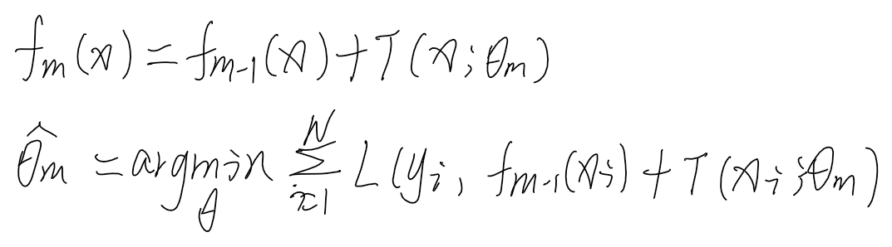
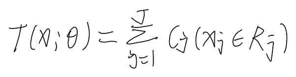
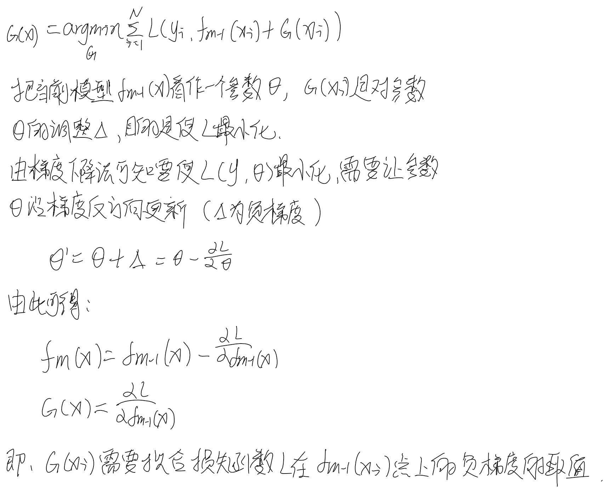
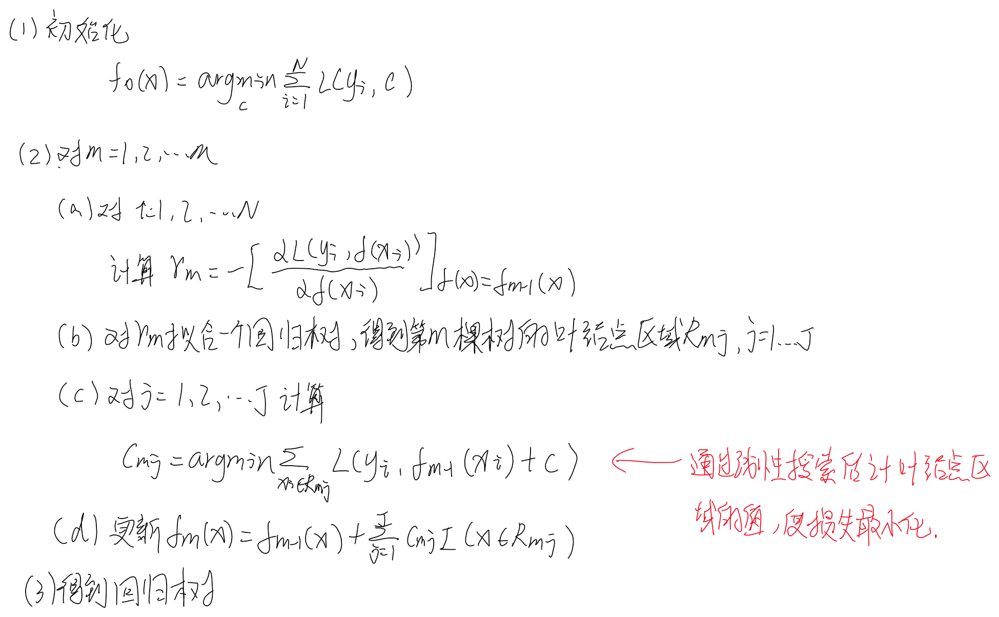

## 提升树模型
* 提升树是以树模型作为基学习器的提升
    

#### 分类提升树
* 对于二分类问题只需静AdaBoost中的分类器改为二类分类树即可

#### 回归问题的提升树
* 回归树将输入空进划分为J个互不相交的区域，每个区域确定一个输出常量，那么回归树模型复杂度为J，模型可以表示为
    
* 回归问题使用提升树，若采用平方误差损失函数，那么第m轮树模型需要拟合的是当前模型的残差。
    

#### 梯度提升树
* 在加法模型和前向分布算法的框架下，如果损失函数为指数和平方损失函数在每一轮的优化很简单，但对于其他损失函数而言优化相对困难（我的理解是很难找到当前模型和当前要学习的基学习器要拟合的关系，像平方损失拟合的是残差），Freidman提出了梯度提升算法，就是利用最速下降的近似方法，让当前基学习器去拟合损失函数在当前模型的负梯度值。
* 推导
        

* 结论：每一轮基函数拟合的是损失函数的负梯度在当前模型的值
* GBDT
        

    